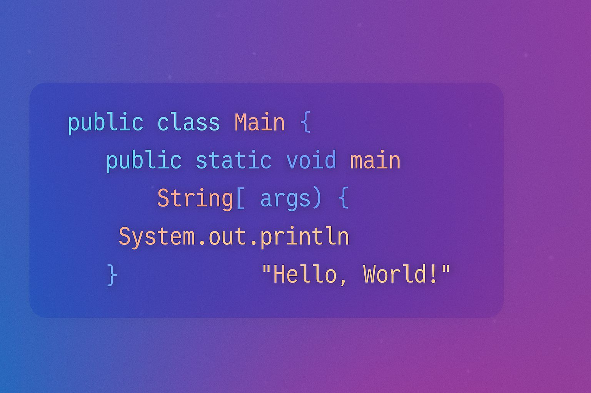

<!--
  README for: pankajj07
  Make sure this repo is named exactly "pankajj07" and is public.
  Place ppp.png in the repo root or remove the banner .
-->

  

  <!-- Optional banner — ensure ppp.png exists in repo root -->
  

  
  
  
  
  

---

## 👨‍💻 About Me

- 💼 Full Stack Developer @ **AstroTime**
- 🌱 Exploring **DevOps** (CI/CD, containerization, infra-as-code)
- 💡 I build with **Java/Spring**, **.NET/C#**, **JavaScript**, and **cloud-native** patterns
- 📄 **Resume / Portfolio:** <a href="https://www.linkedin.com/in/pankajj07">LinkedIn Profile</a>
- ⚡ Fun fact: _Debugging is like being a detective in a crime movie where you are also the culprit._

---

## 🧰 Tech Stack

  <!-- Core -->
  
  
  
  
  
  <!-- Databases -->
  
  
  <!-- Infra / Cloud / Tools -->
  
  
  

  
<b>⚙️ DevOps tools I'm exploring</b>

   
  

    
    
    
    
    
    
  

---

## 📈 GitHub Analytics

## 📈 GitHub Analytics

  <!-- Removed include_all_commits + kept caching to reduce rate limit hits -->
  
  

  

---

## 🔗 Connect With Me

  
  
  
  

---

## ✨ Signature

<i>“Code. Debug. Learn. Repeat.”</i>

⭐️ If you like my work, consider giving a star to the repos!

<!-- Optional extras:
1) Contribution Snake: https://github.com/Platane/snk
2) Activity Graph: https://github.com/Ashutosh00710/github-readme-activity-graph
3) Pin repos: https://github-readme-stats.vercel.app/api/pin/?username=pankajj07&repo=<REPO_NAME>&theme=radical
-->
